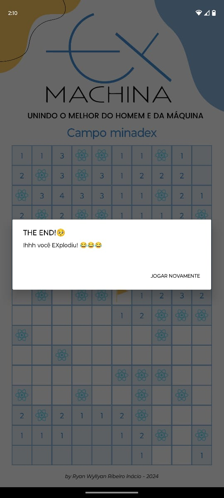

    <h1>CAMPINEX</h1>
    

Este foi um jogo de campo minado desenvolvido em React Native como projeto final da capacitação desta tecnologia.

## Detalhes sobre o jogo

O projeto conta apenas com uma tela, na qual estão presente os quadrados do campo minado que contam com as bombas escondidas. Para abrir um quadrado basta clicar sobre ele e para marcar uma possível bomba basta clicar e segurar o quadrado.

Caso clique em uma bomba um alert aparecerá indicando que você perdeu. Ou se encontrar todas as bombas você será avisado que venceu o jogo por meio de outro alert. Vale ressaltar que ambos avisos tem um botão para jogar novamente. Como é mostrado pela imagem abaixo:

   
</dvi>
